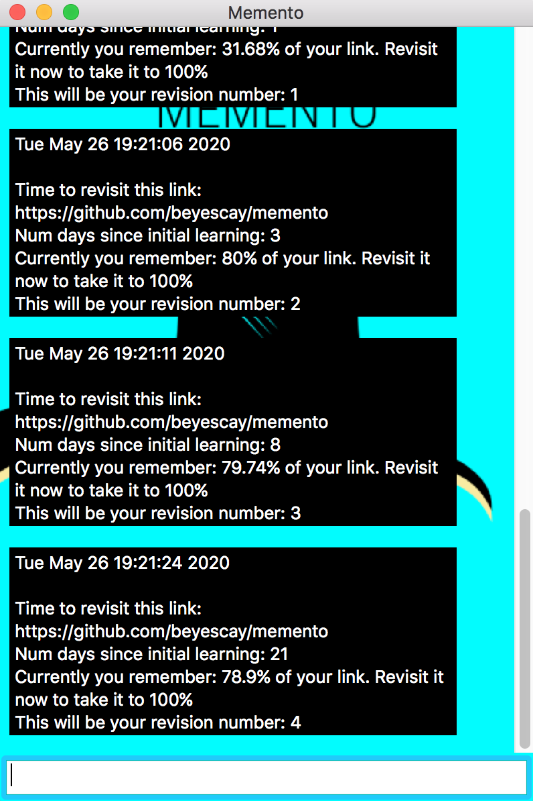

# Memento - Readme for the capstone project of Udacity's C++ Nanodegree


## About

<p align="center"></p>

Memento is a simple chatbot style app that helps users to remember information forever. It uses the `Hermann Ebbinghaus` forgetting curve and the concept of `"Spaced Repitition"` to help users to retain information in their memory forever.

When we learn something new it gets stored in our memory. But the memory fades away over time. With repeated repititions (revisions) at particular optimal intervals, we can persist this memory forever. For e.g., if we learn the meaning of a new word on Day 0, then with repeated revisions of the meaning of the same word on Day 1, 3, 8 and 21, we can remember that word forever. And this concept of repeated revisions at optimal intervals is called `Spaced Repitition`.

 In a normal week, we learn a lot of new information on various days of the week which we would like to remember forever. But, it would be a really difficult task to manually keep track of the revision schedule of all these different new information. It is almost impossible. And, this is where Memento helps. When an user learns something new, the user enters a short description about the new information in the app. Then the app keeps track of the revision schedule of that particular information. And, when it is time to revise, it sends a notification in the app asking the user to revise. This way the user does not have to worry about manually keeping track of the revision schedule.

 In short, Memento is just an automated revision schedule tracker. For a much more detailed and fun description of the app, please refer to this [README](README.md)

## How it works 

When an user enters the required details about a new information in the app, a timer starts. When the timer reaches the first checkpoint of 24 hrs (Day 1), the app will send a notification asking the user to revisit that information. Similary, it would send notifications for subsequent checkpoints - Day 3, Day 8 and Day 21. After the fourth checkpoint, the timer stops.

Currently, the app can help an user remember the following.
1. Files (For e.g., notes stored in a text file).
2. Web links (For e.g. a blog link on French Revolution).
3. Generic text (Whatever typeed in the text box. For e.g., Hola - Hello)

For e.g., you can type in something similar to this!
<p align="center"></p>

As soon you enter the URL, the timer starts. When the timer reaches the first checkpoint, it sends a notification in the app asking the user to revisit the link. 

Just like this!
<p align="center">
  
</p>

And, similarly for the subsequent checkpoints.

<p align="center">
  
</p>

Note: The notifications will always be in black color to help user differentiate between chat response and notifications. Also, in these snapshots the days are simulated as seconds. That's why the notifications are within seconds. In reality, this would actually be in days. But currently, it is still set to seconds so that the reviewer could test this app. To change it to days, change the `seconds` to `days` in lines 24 and 25 of `src/forgetting_curve.cpp`

And then the same steps can be repeated for other new information that the user wants to remember.

For a much more detailed information on the math behind the Spaced Repitition pattern `1-3-8-21`, check out this topic - [But, why 1-3-8-21?](https://github.com/beyescay/memento/blob/master/README.md#but-why-1-3-8-21-)

## Package Requirements

The project uses [wxWidgets](https://www.wxwidgets.org/) for the GUI. 

* To install wxWidgets on Mac - [Compiling wxWidgets using the command line](https://wiki.wxwidgets.org/Compiling_wxWidgets_using_the_command-line_%28Terminal%29)

* To install wxWidgets on Linux - ```sudo apt-get -y install libwxgtk3.0-dev```

* To install wxWidgets on Windows and other platforms - [Installing wxWidgets](https://wiki.wxwidgets.org/Install#Windows)

## Build and Run

The project uses CMAKE as its build tool. On a terminal, cd to the root directory of the project and type, 

```
mkdir build
cd build
cmake ..
make
```

To start Memento type, 

```
./memento
```

Follow the prompts on the app to use Memento for tracking revision schedules.

## Descriptions of various classes

* `gui.h/gui.cpp` - Memento's GUI class that uses wxWidgets library. The GUI interacts with the user and displays notifications from multiple threads. Program starts in this class. Main function is abstracted inside wxWidgets App class.

* `forgetting_curve.h/forgetting_curve.cpp` - Class that keeps track of the time since the user learnt a new information and computes the retention (recall) of an information based on the elapsed time. The retention is computed based on an exponential curve. It sends a notification when the retention goes below a certain pre-defined threshold. For more details on the math behind the retention, check out this [link](https://github.com/beyescay/memento/blob/master/README.md#but-why-1-3-8-21-)

* `knowledge.h/knowledge.cpp` - Class to contain the information that user wants to remember. Uses inheritance to define various type of information such as `FileKnowledge` class for information in text files, `LinkKnowledge` to store URLs, `TextKnowledge` to store text entered directly in the GUI. Currently, there are no invariants defined on the type of information in these different classes. But, it can be added and that was the reason behind defining this class. Each `Knowledge` class object contains its own `Forgetting Curve` class to keep track of the retention.

* `memento.h/memento.cpp` - Core class of Memento App that mediates the interactions between the GUI and the tracker. Creates the appropriate `Knowledge` class based on the user text and starts it's `Forgetting Curve` timer on a separate thread and listens for notifications from the new thread.

* `message_queue.h` - Template class to define a message queue to send messages between different threads.

## Program Schematic

<p align="center">

</p>

## Addressed Rubric points

* `Loops, Functions, I/O`
    * The project demonstrates an understanding of C++ functions and control structures - `forgetting_curve.cpp : Line 16`
    * The project accepts user input and processes the input - `gui.cpp : Line 32`

* `Object Oriented Programming`
    * The project uses Object Oriented Programming techniques - `memento.h : Line 15`
    * Classes use appropriate access specifiers for class members - `memento.h : Line 17, 28`
    * Class constructors utilize member initialization lists - `memento.cpp : Line 7`
    * Classes abstract implementation details from their interfaces - `forgetting_curve.h : Line 33, 34`
    * Classes follow an appropriate inheritance hierarchy - `knowledge.h : Line 31, 39, 47`
    * Derived class functions override virtual base class functions - `knowledge.h : Line 35, 43, 51`
    * Templates generalize functions in the project - `message_queue.h : Line 10`
    
* `Memory Management`
    * The project uses destructors appropriately - `forgetting_curve.cpp : Line 78`
    * The project uses smart pointers instead of raw pointers - `memento.h : Line 31`

* `Concurrency`
    * The project uses multithreading - `forgetting_curve.cpp : Line 12, memento.cpp : Line 66, 73, 80`
    * A mutex or lock is used in the project - `message_queue.h : Line 26`
    * A condition variable is used in the project - `message_queue.h : Line 19`
