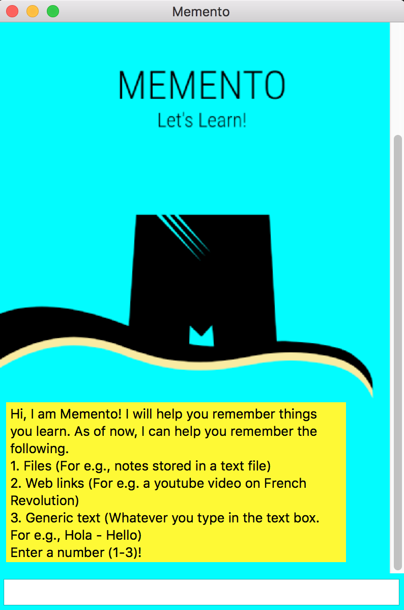
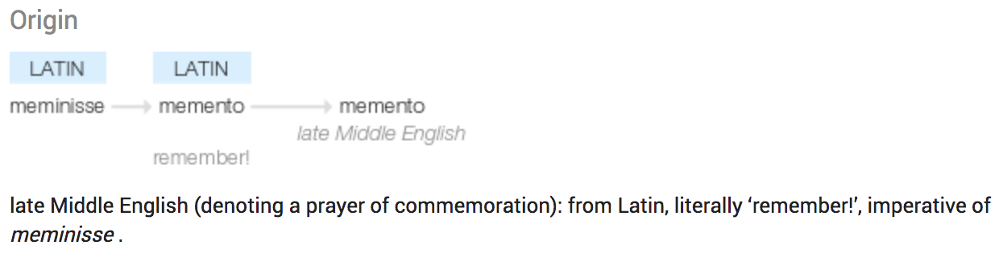
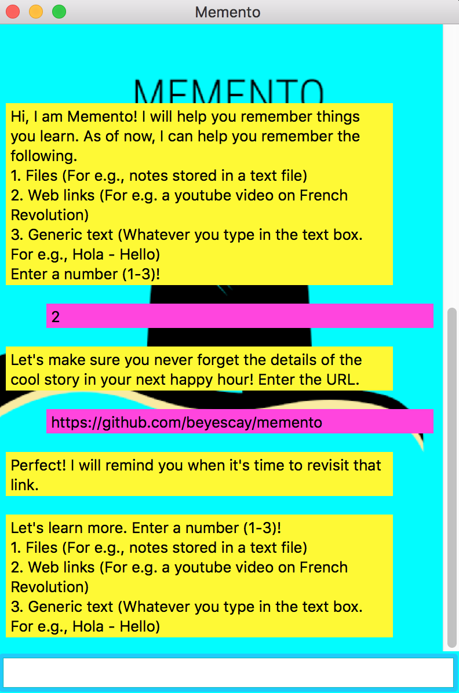
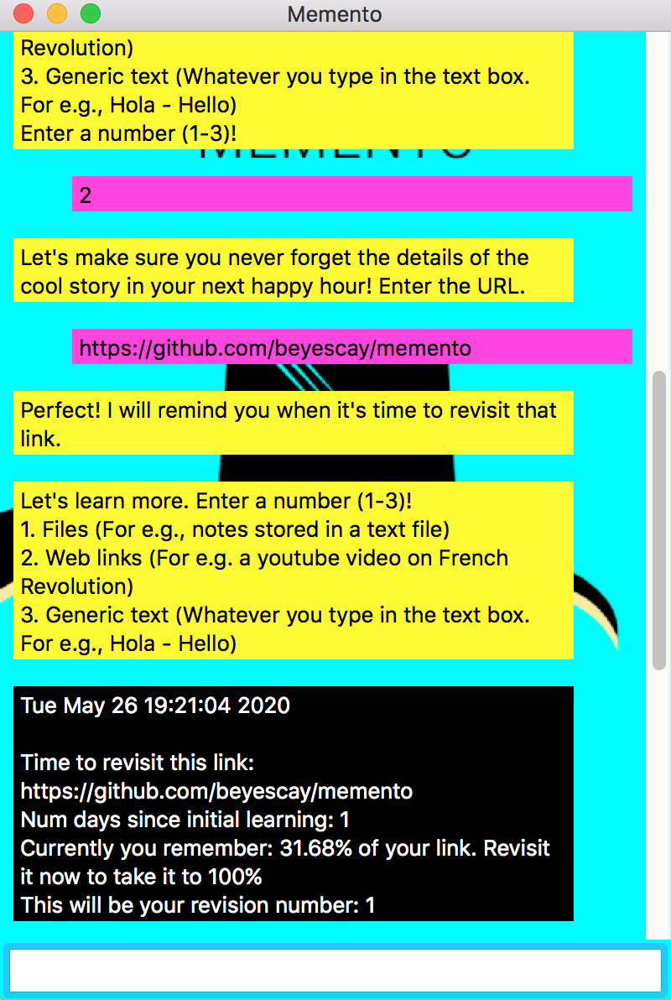
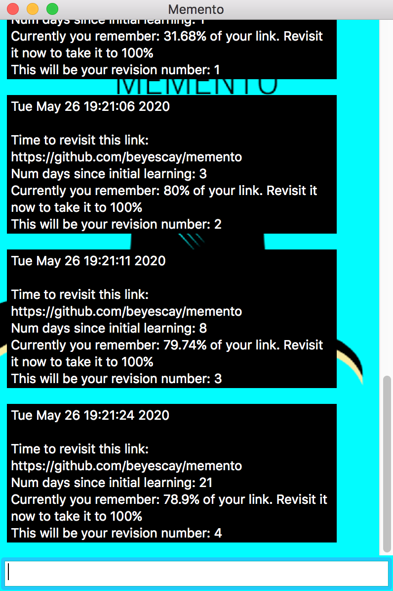

# Memento - Let's Learn!
<p align="center"></p>


## So, who are you?

Hi there, I am Memento! 

I am a simple chatbot style app written in C++ that helps you to remember information forever. I make use of the `Hermann Ebbinghaus` forgetting curve, and the concept of `"Spaced Repitition"` to help users to retain information in their memory forever.

If you are looking for a much shorter description about me, and also for instructions on how to build and run me, check out this [CAPSTONE README](CAPSTONE_README.md). But if you are looking for some fun read, then read on!

## Sorry, I forgot your name! Can you tell me yours again?

You are not the only one, I get that a lot! Now you know why I exist ;) 

If it helps, here is the origin of my name.

<p align="center"></p>


## Okay, but tell me how I can remember the entire lyrics of Hamilton, but I can't remember how many Pounds equal a Kilogram?

Human memory is very powerful, complex and super fascinating. But it is very fragile. Humans forget information easily. Though, they don't forget information that gets stored in their long-term memory such as birthdays, their first language etc., they easily forget information stored in their short-term memory. For example, try recalling the name of the forgetting curve that I mentioned earlier ;) Most likely, you could not! This is because that information did not make it into your long-term memory from your short term memory. And, there are so many theories that explain why humans forget information from their short-term memory. 

Mainly, it is due to 4 reasons. 

* `Retrieval Failure` - explains that humans don't forget, but instead they lose the ability to retrieve the information, and thus giving them the "sense" of forgetting. With the right cues, this information can be successfully retrieved from the memory (Remember Mind Palace from Sherlock Holmes ?) 

* `Interference` - posits that the information humans are trying to remember gets jumbled up with other information in the memory, and thus losing the ability to recall. 

* `Ineffective encoding` - suggests that careful attention was not paid to an information, that the information never even made to the short term memory in the first place. If you forgot the name of that forgetting curve earlier, it is probably due to this. The most common reason why people forget information is due to something called "Memory Fading" or "Decay theory".

* `Decay theory` - expounds that every new information that a person learns decays over time. And, this is applicable only for short-term memory (Information in the long-term memory never decays in normal circumstances). The curve that shows this decay of memory over time is called the `Forgetting curve`, developed by `Hermann Ebbinghaus` in 1885. (Can you believe that ? In 1885!! So, since 1885 humans were trying to solve one of the most popular dilemmas that they face while shopping in a grocery store - "Ah, what's the fourth item in that shopping list note on my fridge ???")

Though the memory decays over time, with repeated repititions (revisions) of the same information, the decay rate can be changed. This implies that with optimally scheduled repititions (revisions), we can move an information to the long-term memory, and thus remembering the information forever (Yay!!). This concept of optimally scheduled repititions is called `Spaced Repitition`. 

Though, there are numerous techniques to enforce an optimal "Spaced Repitition", I use a technique that I call - `1-3-8-21`. Say, you learn a new information on Day 0, then with repeated repitition of this same information on Days 1, 3, 8 and 21, this information can be remembered forever. And, this simple technique is the core idea behind me. (To understand why `1-3-8-21`, check out the section `Why 1-3-8-21?` at the bottom of this page)

And btw, 1 Kg = 2.20462 pounds :)

## But, why Memento? Haven't you heard of Sticky notes?

I think I am better than sticky notes for many reasons. For starters, I don't fall off from your fridge door directly into oblivion ;)

In a normal week, humans learn a lot of new information on various days of the week which they would like to remember forever. But, it would be a herculean task to manually keep track of the spaced repitition schedule of all these different new information. And, this is where I can help. I can keep track of the revision schedule of every new information that you learn. And when it is time to revise/revisit, I will send you a notification in the app asking you to revise. This way you don't have to worry about keeping track of time.

Also, there are atleast dozen other sophisticated and cool apps like SuperMemo, Brainscape, Anki etc., that use much more complex machine learning algorithms along with Spaced Repititions to achieve the same goal. But, they all are very structured and very focused learning apps. Predominantly, they all use flash card style information to learn a new concept, for e.g., spanish vocab. But none of them can be used for information that can't be organized into flash cards. And, this was my writer's main motivation. I came out of his personal need to remember "non flash-card" style information. (Also, he is bad with names too. Shhhh!)

Suppose say, you watched a video on youtube that explains how humans always have room for dessert. Next day, you went to a Thanksgiving dinner, and voila, you got a perfect opportunity to explain how you can still eat that Pumpkin Pie after that Turkey. But unfortunately, you forgot the explanation. You could have avoided this if you had remembered to watch that video again before you went to the dinner. But, I see the problem here! You forgot to remember to remember to rewatch to remember the video. (Oof, Inception much?) But, don't worry! That's where I come into the picture. And, that's why I am better than your Sticky notes. 

## Okay, I am convinced! Now, How do you work?

So, when you enter a new information (that you want to remember) in the app, I start a timer. When the timer reaches the first checkpoint of 24 hrs (Day 1), I will send you a notification in the app asking you to revisit that information. Similary, I would send notifications for subsequent checkpoints - Day 3, Day 8 and Day 21. After the fourth checkpoint, the timer stops and congrats, now you will never forget anything in your next thanksgiving dinner. 

Currently, I can help you remember the following.
1. Files (For e.g., notes stored in a text file).
2. Web links (For e.g. a blog link on French Revolution).
3. Generic text (Whatever you type in the text box. For e.g., Hola - Hello)

For e.g., You can type in something like this!
<p align="center"></p>

As soon you enter the URL, I start the timer. When the timer reaches the first checkpoint, I send a notification in the app asking you to revisit the link. 

Just like this!
<p align="center">
  
</p>

And, similarly for the subsequent checkpoints.

<p align="center">
  
</p>

My notifications will always be in black color to help you differentiate between my chat response and notifications. Also, in these snapshots the days are simulated as seconds. That's why you see notifications that are within seconds. In reality, this would actually be in days. To change it to days, change the `seconds` to `days` in lines 24 and 25 of `src/forgetting_curve.cpp`

And then you can repeat the same steps for other new information that you learn. Happy Learning!

## Why 1-3-8-21 ?

I am glad you asked! Before we understand that, let's learn some new terms.

* `Retention` - Retention is percentage of an information that one could remember or recall. When you learn something new, you can remember almost 100% of it. So the retention is 100%. But, retention drops down exponentially with time. This is the reason why you can't recall 100% of a new information that you learnt just few hours back.

* `Stability` - Stability refers to stability of a particular memory. If a memory is highly stable, then it would take long time for that memory to disapper and vice versa. Long-term memories have almost infinity stability. When you learn something new for the first time, it has a very low stability. But, when you revise that same information after a particular interval, the stability increases. This is the reason why with repititions you could improve the stability of a memory, and thus remembering it forever.

Now, it's time for some math!

As expained above, `Retention` of a new information follows an exponential curve that is given by,

```
r = e^(-t/s)

where,
r - retention
t - time elapsed since learning
s - stability
```

As mentioned above, `Stability` increases after every revision/repitition. The increase in stability is given by,

```
s_new = s * (s_inc * e^(-g * r))

where,
s_new - new stability after a repitition
s - current stability before repitition
s_inc - constant that tells the maximum ratio of stability increase
g - gain constant that is defined by the interval (spaced repitition pattern)
r - retention
```

Typically, the constant values are `s_inc = 26.31` and `g = 2.96`. If we plug these constants into the above equation we get, 

```
s_new = s * (26.31 * e^(-2.96 * r))
```

Also, typically the initial stability value is `s = 0.87`. So we use this to obtain the new stability and repeat the process.
So, when we learn a new information the retention curve would look like,
```
r = e^(-t/0.87)
```

Now, the tricky part is to use these two equations to come with a repitition scheme. The goal is to increase the stability of a memory in few repititions as well as in the shortest amount of time possible. We achieve maximum stability increase when the retention is 0% i.e. when the memory almost disappears. But, when we repeat (revise) only when the retention goes to 0%, it is going to take many months to achiever our goal. At the same time, if we repeat when the retention is 100%, we get the least amount of stability increase, and we have to do a lot of repititions to achieve our goal (You don't want to revise a topic every two hours right!). So, we have to arrive at a sweet spot. And the sweet spot that my creator came up with is `"1-3-8-21"`.

So with this pattern, these are the values we get for stability and retention.

```
Day 1: Retention = 31%, New Stability = 9.14
Day 3: Retention = 80%, New Stability = 22.52
Day 8: Retention = 80%, New Stability = 55.49
Day 21: Retention = 80%, New Stability = 136.74
```

Note: Even after these 4 repititions, the memory is still going to decay. But we just slowed down the decay rate. To give you an idea of how much of an improvement we have made with this pattern of spaced reptition, here are some numbers.

After the fourth repitition, this is how long it would take to completely forget the information.

```
315 days ~ 10.5 months
```

And without any repititions, guess how long it would take to completely forget the information.
```
2 days
```
Power of Spaced Repitition!

